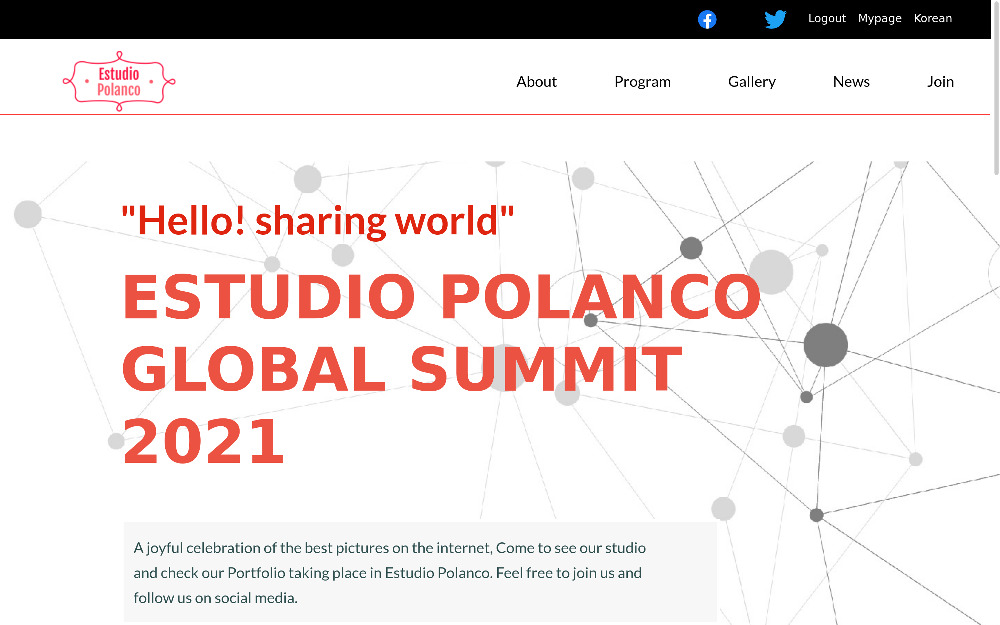
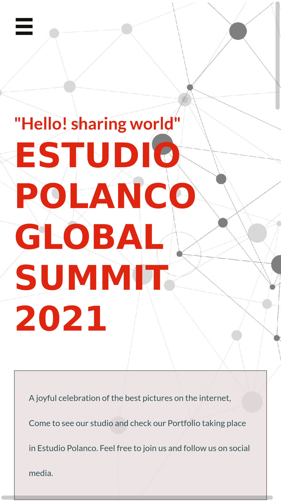

# First Capstone Microverse 2.0

> This is my first Capstone about a photo studio.

  

## Built With

- HTML
- CSS
- JS

## Demo

- Online (https://richie9000.github.io/Studio-Polanco/)

## Project Setup

To visualize the project you need to change your browser's viewport:

For mobile version set the viewport's width up to 767px.
For desktop version set the viewport's width to 768px or more.

To change your browser's viewport remember to use:

- Responsive Design Mode (Firefox)
- Device Mode (Google Chrome)

## Authors

👤 **Ricardo**

- GitHub: [@Richie9000](https://github.com/Richie9000)
- Twitter: [@sevinchek](https://twitter.com/@R1ck1987)

## Credits

Original design idea by [Cindy Shin in Behance](https://www.behance.net/adagio07)

## 🤝 Contributing

Contributions, issues, and feature requests are welcome!

## Show your support

Give a ⭐️ if you like this project
